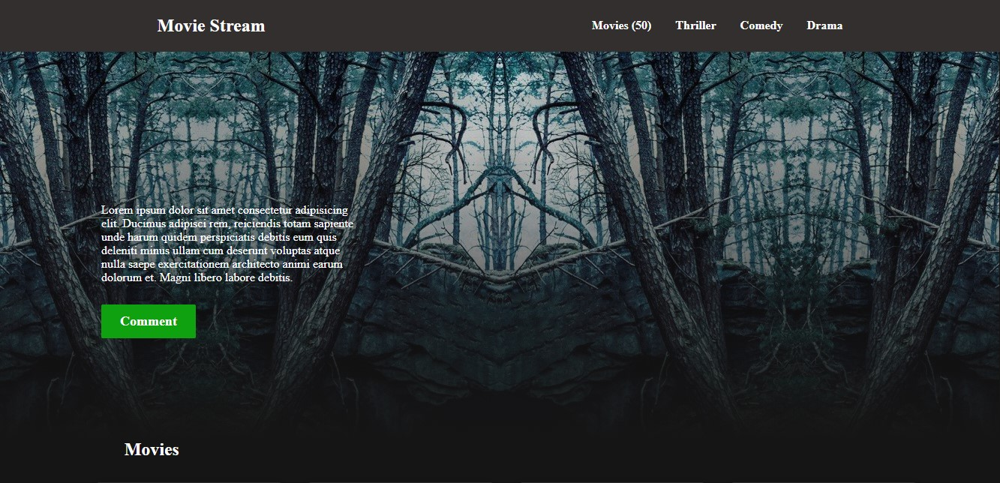
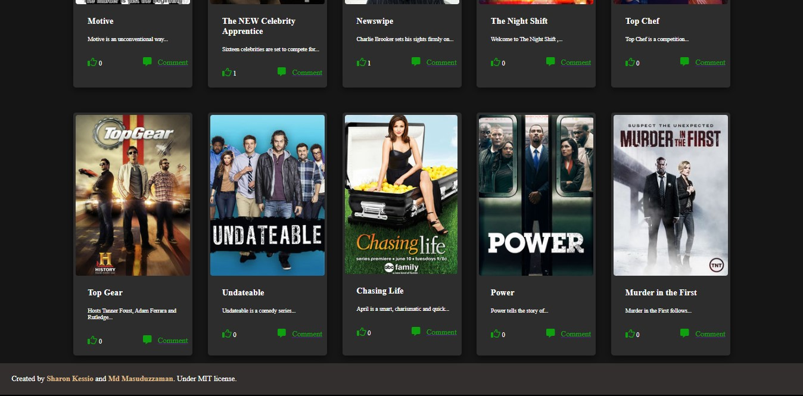
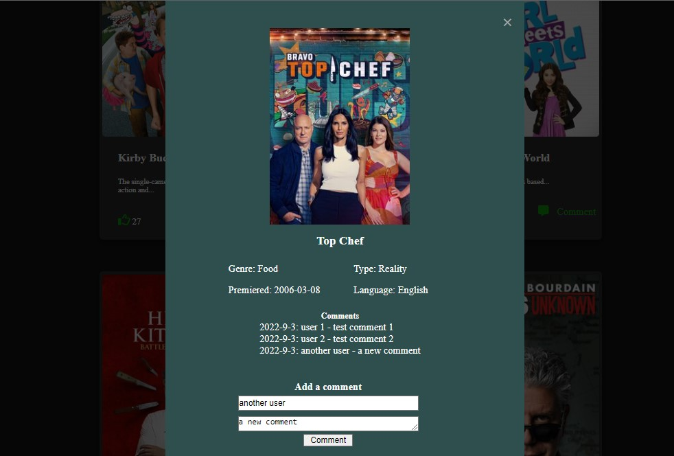

# Movie Streaming Site (Capstone Project)

> Movie Stream is simple webpage, where we fetch movie data from the TVMaze API and implemented some functionality such as popup modal for movie details, add comments, see comments and hit like.

## Screenshots

## Built With

- HTML
- CSS
- JavaScript
- Webpack

## Live Demo 

[Click here to see live!](....)

## Live presentation of the project
[See video presentation)](https://drive.google.com/drive/folders/1GAOtQnzNtthP4m1_i3qMn8Sa2QX9XDgR)

## Getting Started

To get the source code and run in your machine:

- run 'git clone https://github.com/Masuduzzaman811/Kanban-board.git'
- open the project on any code editor
- Run 'npm install' to install the dev dependencies for linters and webpack.
- Run 'npm build' to build the application with webpack .
- Run 'npm run start' to start the development server.
- Run 'npm test' to run the tests.

### What you need
- Web browser
- Code editor

## Authors

👤 **Md Masuduzzaman**

- GitHub: [Masuduzzaman811](https://github.com/Masuduzzaman811)
- Twitter: [@msd_811](https://twitter.com/msd_811)
- LinkedIn: [Masuduzzaman Mohammad](https://www.linkedin.com/in/msd811/)

👤 **Sharon Kessio**

- GitHub: [sharon kessio](https://github.com/kessio)
- Twitter: [@kessio_sharon](https://twitter.com/kessio_sharon)
- LinkedIn: [sharon kessio](https://www.linkedin.com/in/sharon-kessio-172220b5/)

## 🤝 Contributing

Contributions, issues, and feature requests are welcome!

Feel free to check the [issues page](https://github.com/Masuduzzaman811/Kanban-board/issues).

## Show your support

Give a ⭐️ if you like this project!

## Acknowledgments

- [TvMazeAPI](https://www.tvmaze.com/api)
- [Involvement API](https://www.notion.so/Involvement-API-869e60b5ad104603aa6db59e08150270)

## 📝 License

This project is [MIT](./MIT.md) licensed.